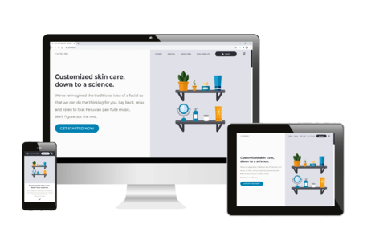

[![MIT License][license-shield]][license-url]
[![LinkedIn][linkedin-shield]][linkedin-url]

<!-- PROJECT LOGO -->
 

  

  <h3 align="center">Glow Labs Facial Bar - CRUD Application</h3>

  

    MERN stack appointment scheduling and employee/client management application
     
     
    <a href="https://glowlabs.ga">View Demo</a>
    ·
    <a href="https://github.com/amamenko/GlowLabs/issues">Report Issue</a> 
  

## Background

Glow Labs, a small business, has been using [Square](https://squareup.com/us/en) for booking appointments, managing clients and employees, and as a point of sale (POS) system. Its website, built by using [Wix](https://www.wix.com/), displays its Square booking workflow
in an iframe. It has also been using [WaiverForever](https://www.waiverforever.com/) for handling consent forms - clients are not able to receive copies.

Square Appointments does not charge a monthly subscription fee if there is only one staff member. However, [a monthly charge of $50 for 2-5 members and $90 for 6-11 members (and even more for even larger teams)](https://squareup.com/help/us/en/article/6238-square-appointments-faqs) is incurred.
Glow Labs has several staff members and therefore has to pay a monthly fee. Square's [POS](https://squareup.com/us/en/point-of-sale/software) system is free to use and there are no setup fees or monthly subscription fees.

Ideally, appointments, consent forms, and profile management would all be handled on the same domain. Also, sensitive client-entered credit card information should be handled securely and integrated with Square's POS system.

## Functionality

<br/ >
 

This is a MERN (MongoDB, Express, React, Node.js) stack application that uses Redux for state management. It has some of the following features:

<strong>Responsive design and performance optimizations by means of:</strong>
* SVG compression using [SVGOMG](https://jakearchibald.github.io/svgomg/), static site image compression using [Squoosh](https://squoosh.app/), and user-uploaded image compression using [browser-image-compression](https://www.npmjs.com/package/browser-image-compression) and [LZString](https://github.com/pieroxy/lz-string)).
* Lazy loading and SVG stroke-dashoffset animation triggers and animation on landing page with the [Intersection Observer API](https://www.npmjs.com/package/react-intersection-observer) and [react-spring](https://www.npmjs.com/package/react-spring).
* [Code-splitting](https://reactjs.org/docs/code-splitting.html) along shopping cart routes and authenticated user routes.

<strong>Guest clients are able to:</strong>
* Add and remove facial treatments and add-ons (certain combinations disallowed) from their shopping cart.
* Select a staff member they would like their service with (or, if no preference, select a random staff member).
* Choose an available time and date for their appointment.
* Fill out contact information and any appointment notes.
* Submit credit card information securely through a [Square Payment Form](https://github.com/square/react-square-payment-form) to hold their appointment. This form is an iframe (no credit card information is stored on Glow Labs' MongoDB database. Rather, this information goes to Square's POS).
* Book selected appointments and receive: 
 * Confirmation and reminder texts via [Twilio](https://www.npmjs.com/package/twilio) and [node-cron](https://www.npmjs.com/package/node-cron) (to which they can reply to confirm their appointment).
 * Confirmation emails (created using the [MJML](https://github.com/mjmlio/mjml) markup language) via [Nodemailer](https://www.npmjs.com/package/nodemailer).
 * Link to fill out and sign a consent form.
* Log in or create an account by entering details or using [Passport](https://www.npmjs.com/package/passport-facebook) to authenticate with Facebook via OAuth 2.0. Authentication is done by [JSON Web Tokens](https://jwt.io/introduction/) and [HttpOnly](https://owasp.org/www-community/HttpOnly) access and refresh cookies, as well as an additional client-visible "dummy" cookie after validation.

<strong>Authenticated clients are able to do all of the above, as well as:</strong>
* See upcoming and past appointments.
* Cancel an upcoming appointment.
* Save their credit card information for future bookings, if they wish (again, this card information is not saved to Glow Labs' MongoDB database, but is queried from [Square](https://github.com/square/square-nodejs-sdk)).
* Download PDF copies of their latest consent forms via [React-PDF](https://www.npmjs.com/package/react-pdf).

<strong>Authenticated staff members are able to:</strong>
* Receive real-time relevant activity updates such as new bookings or cancellations in their employee dashboard via GraphQL [subscriptions](https://www.apollographql.com/docs/react/data/subscriptions/).
* View all clients and staff members and each individual's upcoming and past appointments, as well as PDF copies of client consent forms, if present.
* Update client and their own profile photos by uploading a photo or taking a photo with a [webcam](https://github.com/MABelanger/react-html5-camera-photo).
* Add, delete, or update appointments and personal events in their own calendar.

<strong>Authenticated staff members with "admin" status are also able to:</strong>
* Add new staff members.
* Delete clients and staff members.
* Update all clients' and staff members' profile photos.
* View and manage all staff members' calendars.

<!-- CONTRIBUTING -->
## Contributing

Contributions are welcome!

1. Fork the Project
2. Create your Feature Branch (`git checkout -b feature/MyFeature`)
3. Commit your Changes (`git commit -m 'Add my feature'`)
4. Push to the Branch (`git push origin feature/MyFeature`)
5. Open a Pull Request

<!-- LICENSE -->
## License

Distributed under the MIT License. See `LICENSE.txt` for more information.

<!-- CONTACT -->
## Contact

Avraham (Avi) Mamenko - avimamenko@gmail.com

Project Link: [https://github.com/amamenko/GlowLabs](https://github.com/amamenko/GlowLabs)

<!-- ACKNOWLEDGEMENTS -->
## Acknowledgements
* Glow Labs
* [Square Developer](https://developer.squareup.com/us/en) 
* [Facebook for Developers](https://developers.facebook.com/)
* [Twilio](https://www.npmjs.com/package/twilio)
* [Nodemailer](https://www.npmjs.com/package/nodemailer)
* [MJML](https://github.com/mjmlio/mjml)
* [Moment.js](https://github.com/moment/moment)
* [Google Maps API](https://developers.google.com/maps/)
* [React-PDF](https://www.npmjs.com/package/react-pdf)
* [React Icons](https://react-icons.github.io/react-icons)
* [react-spring](https://www.npmjs.com/package/react-spring)
* [Tippy.js for React](https://www.npmjs.com/package/@tippyjs/react)
* [React Burger Menu](https://github.com/negomi/react-burger-menu)
* [node-cron](https://www.npmjs.com/package/node-cron)
* [Best-README-Template](https://github.com/othneildrew/Best-README-Template)

<!-- MARKDOWN LINKS & IMAGES -->
<!-- https://www.markdownguide.org/basic-syntax/#reference-style-links -->
[license-shield]: https://img.shields.io/github/license/othneildrew/Best-README-Template.svg?style=for-the-badge
[license-url]: https://github.com/amamenko/GlowLabs/blob/master/LICENSE.txt
[linkedin-shield]: https://img.shields.io/badge/-LinkedIn-black.svg?style=for-the-badge&logo=linkedin&colorB=555
[linkedin-url]: https://www.linkedin.com/in/avraham-mamenko-0599831b8
