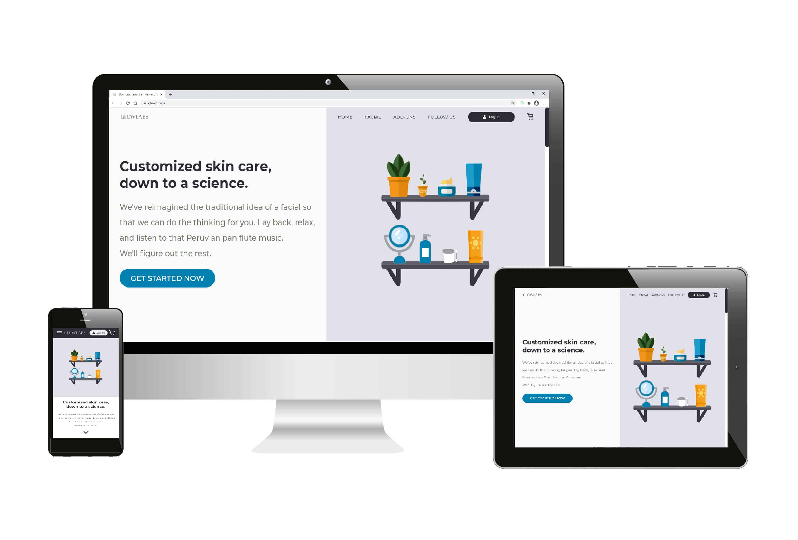

[![MIT License][license-shield]][license-url]
[![LinkedIn][linkedin-shield]][linkedin-url]

<!-- PROJECT LOGO -->
 

  

  <h3 align="center">Glow Labs Facial Bar - CRUD Application</h3>

  

    MERN stack appointment scheduling and employee/client management application
     
     
    <a href="https://glowlabs.ga">View Demo</a>
    ·
    <a href="https://github.com/amamenko/GlowLabs/issues">Report Issue</a> 
  

## Background

Glow Labs, a small business, has been using [Square](https://squareup.com/us/en) for booking appointments, managing clients and employees, and as a point of sale (POS) system. Its website, built by using [Wix](https://www.wix.com/), displays its Square booking workflow
in an iframe. It has also been using [WaiverForever](https://www.waiverforever.com/) for handling consent forms.

Square Appointments does not charge a monthly subscription fee if there is only one staff member. However, [a monthly charge of $50 for 2-5 members and $90 for 6-11 members (and even more for even larger teams)](https://squareup.com/help/us/en/article/6238-square-appointments-faqs) is incurred.
Glow Labs has several staff members and therefore has to pay a monthly fee. Square's [POS](https://squareup.com/us/en/point-of-sale/software) system is free to use and there are no setup fees or monthly subscription fees.

Ideally, appointments, consent forms, and profile management would all be handled on the same domain. Also, sensitive client-entered credit card information should be handled securely and integrated with Square's POS system.

## Functionality

<br/ >
 

This is a MERN (MongoDB, Express, React, Node.js) stack application that has some of the following features:

* Responsive design and performance optimizations by means of:
  * SVG compression using [SVGOMG](https://jakearchibald.github.io/svgomg/), static site image compression using [Squoosh](https://squoosh.app/), and user-uploaded image compression using [browser-image-compression](https://www.npmjs.com/package/browser-image-compression) and [LZString](https://github.com/pieroxy/lz-string)).
  * Lazy loading and SVG stroke-dashoffset animation triggers on landing page with the [Intersection Observer API](https://www.npmjs.com/package/react-intersection-observer).
  * Code-splitting along shopping cart routes and authenticated user routes.
* Guest clients are able to:
  * Add and remove facial treatments and add-ons (certain combinations disallowed) from their shopping cart.
  * Select a staff member they would like their service with (or, if no preference, select a random staff member).
  * Choose an available time and date for their appointment.
  * Fill out contact information and any appointment notes.
  * Submit credit card information securely through a [Square Payment Form](https://github.com/square/react-square-payment-form) to hold their appointment. This form is an iframe (no credit card information is stored on Glow Labs' MongoDB database. Rather, this information goes to Square's POS).

<!-- MARKDOWN LINKS & IMAGES -->
<!-- https://www.markdownguide.org/basic-syntax/#reference-style-links -->
[license-shield]: https://img.shields.io/github/license/othneildrew/Best-README-Template.svg?style=for-the-badge
[license-url]: https://github.com/amamenko/GlowLabs/blob/master/LICENSE.txt
[linkedin-shield]: https://img.shields.io/badge/-LinkedIn-black.svg?style=for-the-badge&logo=linkedin&colorB=555
[linkedin-url]: https://www.linkedin.com/in/avraham-mamenko-0599831b8
